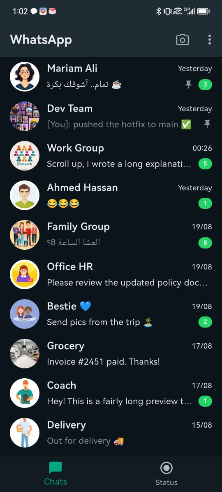
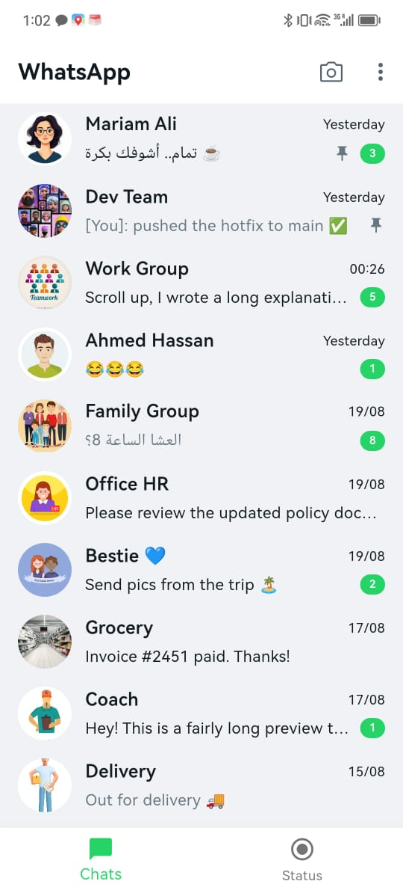
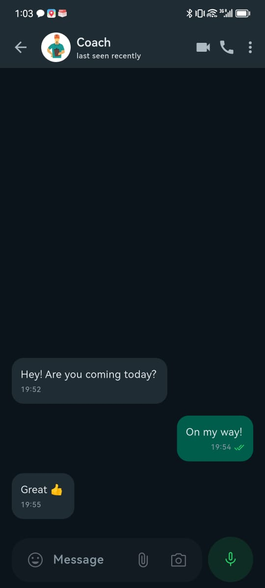
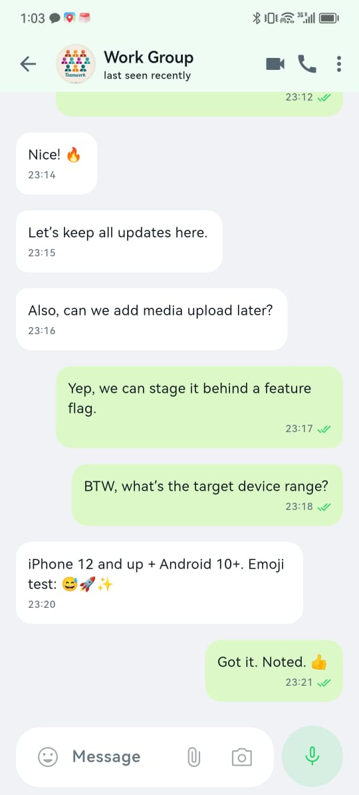
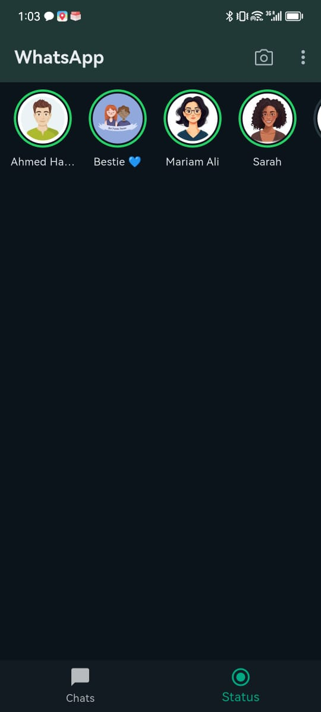
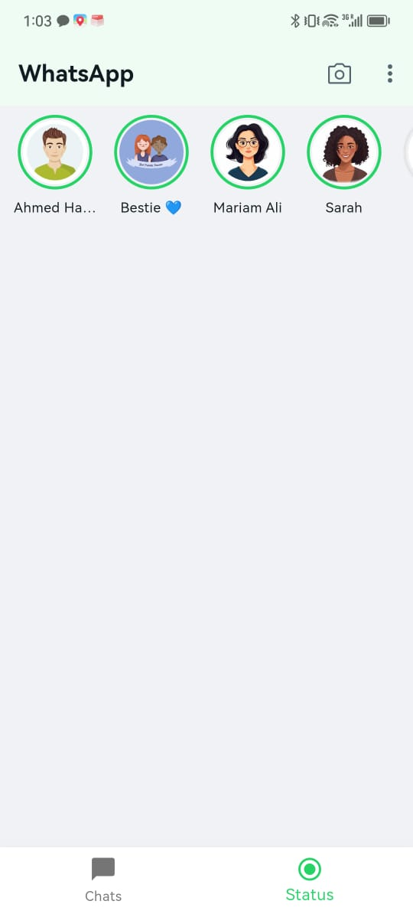

# WhatsApp-Style Flutter UI

The goal was to design and implement the main screens of a **WhatsApp-style mobile app** with pixel-perfect accuracy and production-quality details.

---

## 📱 Features Implemented

- **Home Screen (Chats List)**  
  - List of conversations with avatar, name, last message, timestamp, unread badge.  
  - Smooth **Hero transition** on avatar into Chat screen.

- **Chat Screen (Conversation)**  
  - Bubble-style messages (outgoing/incoming).  
  - Input bar with send button.  
  - **Microinteraction:** animated feedback on sending messages.

- **Stories Screen (Status)**  
  - Grid/list of stories with avatars and status rings.  
  - Full-screen story viewer with progress indicator.  
  - Animated transitions between stories.

---

## 🎨 UI Fidelity

- Colors, fonts, and spacing aligned closely with the original WhatsApp app.  
- Supports **Light and Dark modes**.  
- Responsive design tested on small and large devices.  

---

## ⚡ Animations & Interactions

- **Hero animation** (chat avatar → chat appbar).  
- **Send button feedback animation** (scale/rotate effect).  
- **Story transitions** with progress bar (auto-play).  

---
📸 Screenshots
| Dark Mode                                | Light Mode                                 |
| ---------------------------------------- | ------------------------------------------ |
|  |  |

| Dark Mode                                | Light Mode                                 |
| ---------------------------------------- | ------------------------------------------ |
|  |  |

| Dark Mode                                  | Light Mode                                   |
| ------------------------------------------ | -------------------------------------------- |
|  |  |

🎥 Demo Video
(https://drive.google.com/file/d/1qRkz_iACA5ub6Y7DB_009oezYyPYeq8f/view?usp=drive_link)

## 🧩 Project Structure

```plaintext
lib/
  core/
  data/
    models/
    mock/
  presentation/
    widgets/
    screens/
      home/
      chat/
      stories/
  app.dart
  main.dart
